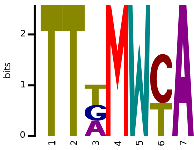
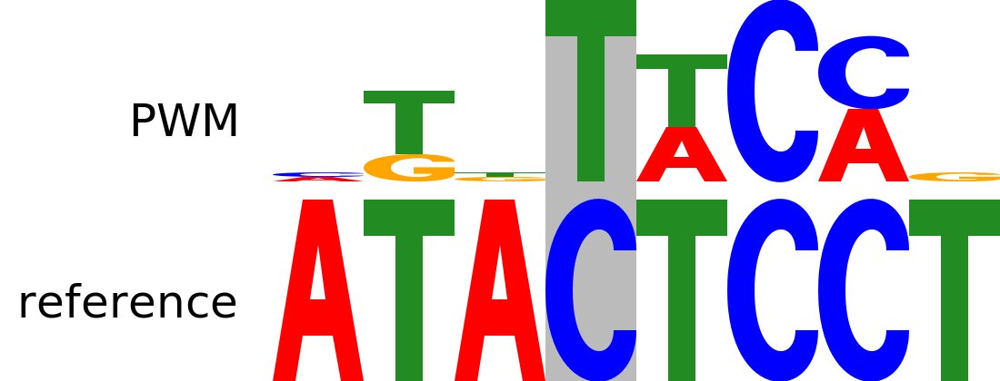

LogosJ is a Javascipt package for creating SVG sequence logos.
In addition to basic DNA, RNA, and protein logos, we support
custom alphabets and variety of advanced logo types and custom annotations.

LogosJ can be used with and without ReactJS. A companion web app makes it easy to share
SVG logos and generate them in batches from the output of common tools such as the MEME Suite.

## Examples

LogosJ supports a wide range of biological use cases. Detailed examples with code samples
are available in this documentation and through our [companion site](http://logosj.wenglab.org/app/gallery).
Shown below are protein, RNA, methyl DNA, dinucleotide, and protein/DNA interaction logos.

<center>

&nbsp;&nbsp;
&nbsp;&nbsp;
&nbsp;&nbsp;
<br>
DNA and RNA logos<br>

<img src="http://logosj.wenglab.org/svg/eyJwcG0iOltbMC4wMSwwLDAuMDIsMCwwLDAuMDQsMCwwLDAuMjEsMCwwLjU1LDAsMCwwLDAsMCwwLDAsMC4wNywwLDAsMF0sWzAuMDMsMCwwLDAuMDMsMCwwLDAsMCwwLDAuMTksMCwwLDAuMDUsMC4zNSwwLjAxLDAuMTEsMC4wMiwwLjE2LDAuMDMsMCwwLjAxLDBdLFswLjAxLDAsMC4wMSwwLDAsMCwwLDAsMC4yLDAsMC4zNSwwLjM5LDAsMCwwLDAsMCwwLDAuMDUsMCwwLDBdLFswLjAyLDAsMC4wMSwwLDAuMDEsMCwwLjAxLDAsMCwwLjA0LDAsMCwwLjAxLDAuMDIsMCwwLDAuMzcsMC41MSwwLDAsMCwwXSxbMCwwLDAsMCwwLDAsMCwwLDAsMCwwLjAyLDAuMDEsMCwwLDAsMCwwLDAsMCwwLDAsMF0sWzAsMCwwLDAsMCwwLDAsMCwwLDAsMCwwLDAuMDIsMCwwLDAsMC4wMSwwLDAsMCwwLDBdLFswLjAxLDAsMCwwLDAsMCwwLDAuMTYsMC4wMSwwLjAyLDAuMDIsMC4wMSwwLjAzLDAsMC4wOCwwLjYzLDAuMDEsMC4wMSwwLDAuMDEsMCwwXSxbMC4xMywwLDAsMC4wMSwwLjExLDAsMC4xOCwwLjAxLDAsMC4wNCwwLjAxLDAuMDEsMC4wNCwwLDAuNCwwLjA0LDAsMC4wMywwLDAsMCwwXSxbMC4wOSwwLDAsMC40NCwwLjQsMCwwLDAsMCwwLDAsMC4wMiwwLjAxLDAsMC4wMywwLDAsMCwwLjAxLDAsMC4wMSwwXSxbMCwwLDAsMCwwLDAsMCwwLDAuNzQsMCwwLjE4LDAuMDYsMCwwLDAsMCwwLDAuMDEsMC4wMSwwLDAsMF0sWzAuNTgsMCwwLDAsMCwwLDAuMzgsMCwwLDAsMCwwLDAsMCwwLDAsMC4wNCwwLDAsMCwwLDBdLFswLjAzLDAsMCwwLjI3LDAuMTQsMCwwLDAuMDEsMCwwLjA0LDAsMC4wMSwwLjI0LDAsMC4xNSwwLjA0LDAuMDcsMC4wMSwwLDAsMCwwXSxbMC4xMiwwLDAsMCwwLDAuMTUsMCwwLjA0LDAuMTEsMCwwLjA4LDAuMTEsMCwwLDAsMC4wMywwLjAxLDAsMC4wMSwwLDAuMzUsMF0sWzAsMCwwLjAzLDAsMCwwLDAsMCwwLjEzLDAsMC41MiwwLDAsMCwwLDAsMC4wNSwwLjA0LDAuMjMsMCwwLDBdLFswLjAzLDAsMCwwLDAsMCwwLjk1LDAsMCwwLDAsMCwwLDAsMCwwLDAuMDIsMCwwLDAsMCwwXSxbMC4wNywwLDAuMTQsMCwwLDAsMCwwLDAsMCwwLjUsMC4wMiwwLDAsMC4wMSwwLDAuMTIsMC4xMywwLjAyLDAsMCwwXSxbMC4wOSwwLDAuMDEsMCwwLDAsMCwwLDAsMC4wMiwwLDAsMCwwLDAsMC4wMSwwLjIxLDAuNjYsMCwwLDAsMF0sWzAuMDEsMCwwLDAsMCwwLDAsMCwwLjE5LDAsMC4xMSwwLDAuMDEsMC4wNiwwLDAuNDEsMCwwLjAxLDAuMjEsMCwwLDBdLFswLDAsMCwwLDAuNzcsMCwwLDAuMDMsMC4wMSwwLDAsMCwwLDAsMC4wNCwwLDAuMDIsMCwwLjEzLDAsMCwwXSxbMCwwLDAsMCwwLDAsMCwwLjAyLDAsMCwwLDAuMDMsMCwwLDAsMCwwLjAzLDAuOTEsMCwwLjAxLDAsMF0sWzAuMDQsMCwwLDAsMCwwLjAxLDAsMCwwLjI0LDAsMC4wMSwwLjAxLDAsMCwwLDAsMCwwLjAyLDAuNjcsMCwwLDBdLFswLjAyLDAsMC4wMSwwLDAsMCwwLjE0LDAsMC4wMSwwLDAsMCwwLjA4LDAsMCwwLDAuNTgsMC4xNiwwLDAsMCwwXSxbMC4wMSwwLDAsMCwwLDAsMCwwLjA0LDAsMC4wNCwwLDAuMDEsMCwwLDAsMC44OSwwLDAuMDEsMCwwLDAsMF0sWzAuMDUsMCwwLjAxLDAsMCwwLDAsMCwwLjE1LDAuMDUsMC4yNywwLjA1LDAsMCwwLjEsMCwwLjAyLDAuMTIsMC4xNSwwLDAsMF0sWzAsMCwwLDAsMCwwLjA5LDAsMCwwLjA4LDAsMC42NSwwLjA4LDAsMCwwLDAsMCwwLDAuMDYsMCwwLDBdLFswLjA0LDAsMCwwLDAsMCwwLjI4LDAsMCwwLjIyLDAsMCwwLjAzLDAsMCwwLjA0LDAuMTQsMC4yMiwwLDAsMCwwXSxbMC4wOCwwLDAsMC4xNCwwLjA2LDAsMC4wMSwwLDAuMDEsMC4xOCwwLjAzLDAuMTEsMCwwLDAuMDMsMC4yOSwwLjAxLDAsMC4wMSwwLDAuMDEsMF0sWzAsMCwwLDAsMCwwLjI3LDAsMCwwLDAsMC42NSwwLDAsMCwwLDAsMCwwLDAsMC4wNCwwLDBdLFswLjA4LDAsMCwwLDAuMjUsMCwwLjAxLDAuMDQsMCwwLjA4LDAsMCwwLDAsMC4yMiwwLjI3LDAuMDEsMC4wMSwwLDAsMCwwXSxbMC4wNywwLDAuMDEsMC4xMywwLjE2LDAsMC4wMSwwLjAyLDAsMC4yOCwwLDAsMC4wMSwwLDAuMTMsMC4wOCwwLjAyLDAuMDUsMCwwLDAsMF0sWzAuMDEsMCwwLDAuMTIsMC4xNywwLDAuMDIsMC4wMSwwLjAxLDAuMDcsMC4wNCwwLjAxLDAuMDYsMCwwLjE4LDAuMSwwLjE0LDAsMC4wMSwwLjAxLDAuMDEsMF0sWzAsMCwwLDAuMDEsMC4wNiwwLDAuNjIsMC4wMywwLDAuMDYsMCwwLDAuMTUsMCwwLjAyLDAsMC4wMSwwLDAsMCwwLDBdLFswLjAyLDAsMCwwLDAsMC4wMywwLDAsMC4wOSwwLjAxLDAuNDEsMC4xMiwwLDAsMCwwLjAxLDAsMC4wMSwwLjIxLDAuMDUsMC4wMSwwXSxbMCwwLDAsMCwwLDAsMCwwLDAuNjUsMCwwLjE3LDAsMCwwLDAsMCwwLDAsMC4xNCwwLDAsMF1dLCJ0eXBlaWQiOjIsInNjYWxlIjoxLCJpc2ZyZXEiOmZhbHNlLCJmaXJzdGJhc2UiOjEsImFscGhhYmV0IjpbeyJyZWdleCI6IkEiLCJjb2xvciI6ImJsYWNrIn0seyJyZWdleCI6IkIiLCJjb2xvciI6IiNiYjg4MDAifSx7InJlZ2V4IjoiQyIsImNvbG9yIjoiIzAwODgxMSJ9LHsicmVnZXgiOiJEIiwiY29sb3IiOiIjZmYwMDAwIn0seyJyZWdleCI6IkUiLCJjb2xvciI6IiNmZjAwMjIifSx7InJlZ2V4IjoiRiIsImNvbG9yIjoiIzMzMzMzMyJ9LHsicmVnZXgiOiJHIiwiY29sb3IiOiIjMDA3NzAwIn0seyJyZWdleCI6IkgiLCJjb2xvciI6IiMyMjAwOTkifSx7InJlZ2V4IjoiSSIsImNvbG9yIjoiIzExMTExMSJ9LHsicmVnZXgiOiJLIiwiY29sb3IiOiIjMDAwMGFhIn0seyJyZWdleCI6IkwiLCJjb2xvciI6IiMwMDIyMjIifSx7InJlZ2V4IjoiTSIsImNvbG9yIjoiIzIyMDAyMiJ9LHsicmVnZXgiOiJOIiwiY29sb3IiOiIjMDA5OTExIn0seyJyZWdleCI6IlAiLCJjb2xvciI6IiMwODA4MDgifSx7InJlZ2V4IjoiUSIsImNvbG9yIjoiIzAwYWEwMCJ9LHsicmVnZXgiOiJSIiwiY29sb3IiOiIjMDAyMmFhIn0seyJyZWdleCI6IlMiLCJjb2xvciI6IiMwMDhmMDAifSx7InJlZ2V4IjoiVCIsImNvbG9yIjoiIzAwNjYwMCJ9LHsicmVnZXgiOiJWIiwiY29sb3IiOiIjMjIyMjAwIn0seyJyZWdleCI6IlciLCJjb2xvciI6IiMwODA4MDgifSx7InJlZ2V4IjoiWSIsImNvbG9yIjoiIzAwYTgwMCJ9LHsicmVnZXgiOiJaIiwiY29sb3IiOiIjYWFhYTAwIn1dfQ==" alt="protein logo" width="100%"><br>
protein logo<br>

&nbsp;&nbsp;&nbsp;&nbsp;&nbsp;&nbsp;&nbsp;&nbsp;&nbsp;&nbsp;&nbsp;&nbsp;
<br>
advanced annotations<br>

</center>

## Using in your web application
You can add LogosJ to your project using NPM or Yarn:
```sh
yarn add logosj-react
```
or
```sh
npm install logosj-react
```

If you want to use LogosJ in a static web page, you can simply include the package with a
static script tag, which will add LogosJ to the global namespace as `logosj`:

```html
<script src="http://bundle.logosj.wenglab.org/bundle.js" type="text/javascript">
</script>
```

## Quick example: a DNA logo

The transcription factor CTCF binds a well-known consensus DNA sequence, rendered below with LogosJ:


If you use ReactJS, the following code creates the CTCF consensus binding logo:

```js
import { DNALogo } from 'logosj-react';

const CTCF_PPM = [
  [0.09, 0.31, 0.08, 0.50], [0.18, 0.15, 0.45, 0.20], [0.30, 0.05, 0.49, 0.14],
  [0.06, 0.87, 0.02, 0.03], [0.00, 0.98, 0.00, 0.02], [0.81, 0.01, 0.07, 0.09], 
  [0.04, 0.57, 0.36, 0.01], [0.11, 0.47, 0.05, 0.35], [0.93, 0.01, 0.03, 0.01],
  [0.00, 0.00, 0.99, 0.01], [0.36, 0.00, 0.64, 0.00], [0.05, 0.01, 0.55, 0.37], 
  [0.03, 0.00, 0.97, 0.00], [0.06, 0.00, 0.85, 0.07], [0.11, 0.80, 0.00, 0.07],
  [0.40, 0.01, 0.55, 0.01], [0.09, 0.53, 0.33, 0.04], [0.12, 0.35, 0.08, 0.43], 
  [0.44, 0.19, 0.29, 0.06]
];

export const CTCFLogo = props => (
    <DNALogo ppm={CTCF_PPM} />
);
```

If you don't use React, the following code embeds the DNA logo in a `div` element:

```html
<!doctype html>
<html>
  <body>
    <script src="http://bundle.logosj.wenglab.org/bundle.js" type="text/javascript"></script>
    <div id="logo" style="width:500px"></div>
    <script type="text/javascript">
      const CTCF_PPM = [
        [0.09, 0.31, 0.08, 0.50], [0.18, 0.15, 0.45, 0.20], [0.30, 0.05, 0.49, 0.14],
        [0.06, 0.87, 0.02, 0.03], [0.00, 0.98, 0.00, 0.02], [0.81, 0.01, 0.07, 0.09], 
        [0.04, 0.57, 0.36, 0.01], [0.11, 0.47, 0.05, 0.35], [0.93, 0.01, 0.03, 0.01],
        [0.00, 0.00, 0.99, 0.01], [0.36, 0.00, 0.64, 0.00], [0.05, 0.01, 0.55, 0.37], 
        [0.03, 0.00, 0.97, 0.00], [0.06, 0.00, 0.85, 0.07], [0.11, 0.80, 0.00, 0.07],
        [0.40, 0.01, 0.55, 0.01], [0.09, 0.53, 0.33, 0.04], [0.12, 0.35, 0.08, 0.43], 
        [0.44, 0.19, 0.29, 0.06]
      ];
      logosj.embedDNALogo(document.getElementById("logo"), { ppm: CTCF_PPM });
    </script>
  </body>
</html>
```
